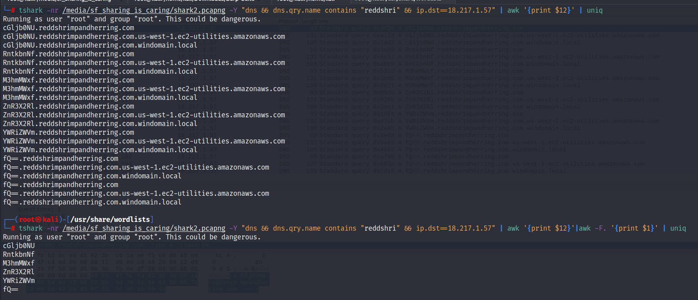
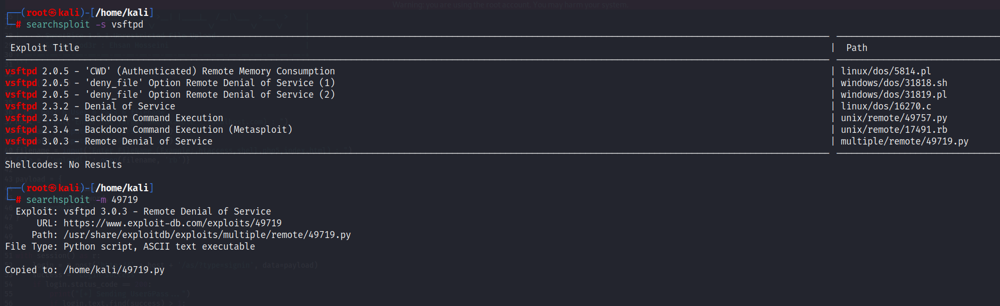

# FOR LINUX

Tags: find, hacking, linux, netcat nc, python cmds, searchploit, virtual environment

# Index:

## To update KEY gen in VM:

- Key gen:
    
    ```powershell
    sudo apt-key adv --keyserver hkp://keyserver.ubuntu.com:80 --recv-keys <VALUE>
    ```
    

## RUN python Server:

```kotlin
python2 -m SimpleHTTPServer 8080
```

## Listening using Netcat:

```kotlin
nc -nlvp 4444
```

## AWK cmd:

- Print the text found after the 11 space in the output of previous cmd

```powershell
awk '{print $12}'
```



## To reverse the string:

```powershell
rev
<INPUT>
```

## Searchexploit:



- to download the exploit

```powershell
searchpolit -m <ID>
```

## Python Virtual Environment:

- Make the virtual environment having python 2

```powershell
virtualenv -p /usr/bin/python2.7 <_name_>
```

- Run the environment:
    
    ```powershell
    source venv/bin/activate
    ```
    


[https://it.engineering.oregonstate.edu/setting-virtual-environments-python](https://it.engineering.oregonstate.edu/setting-virtual-environments-python)

## Find cmd:

- To find the file by its name

```powershell
find . -name <file full name>
```

- [https://www.plesk.com/blog/various/find-files-in-linux-via-command-line/](https://www.plesk.com/blog/various/find-files-in-linux-via-command-line/)

## tr:

- To edit in the text file like sed:’
- Remove \n with white space
    
    ```powershell
    tr '\n' '' < temp.txt
    ```
    

## Ciphey:

- Automatically decrypt the text:

## Gnome-ternimal : Terminal from Terminal:

```powershell
gnome-terminal -- sh -c "bash -c \"echo hello ; exec bash \""
```

## Network CMDS:

- PING:
    
    ```powershell
    ping <IP>
    
    ping -c 10 <IP>  // 10 packets to send
    
    ping -s // set the size of the ICMP request
    ```
    
- traceroute:
    - The purpose of a traceroute is to find the IP addresses of the routers or hops that a packet traverses as it goes from your system to a target host
        
        > TTL indicates the maximum number of routers/hops that a packet can pass through before being dropped
        > 
        
        ```powershell
        traceroute <IP>  // linux
        tracert <IP>  // Windows
        ```
        
- Telnet
    - The TELNET (Teletype Network) protocol was developed in 1969 to communicate with a remote system via a command-line interface (CLI). Hence, the command `telnet`
     uses the TELNET protocol for remote administration. The default port used by telnet is 23. From a security perspective, `telnet`
     sends all the data, including usernames and passwords, in cleartext. Sending in cleartext makes it easy for anyone, who has access to the communication channel, to steal the login credentials. The secure alternative is SSH (Secure SHell) protocol.
        
        ```powershell
        telnet <IP> <port>
        ```
        

## Make directory with all permissions:

```powershell
mkdir -m777 <name>
```

## New line in single ECHO:

```powershell
echo -e "hello \n sir"
```

## Run cmd in new terminal:

```powershell
gnome-terminal -- sh -c "bash -c \"echo "hello"; exec bash\""
```

## TEE:

- Append to file

```powershell
tee -a $Target.txt
```

 update for the kali repos:

- [https://www.metahackers.pro/speed-kali-linux-update/](https://www.metahackers.pro/speed-kali-linux-update/)